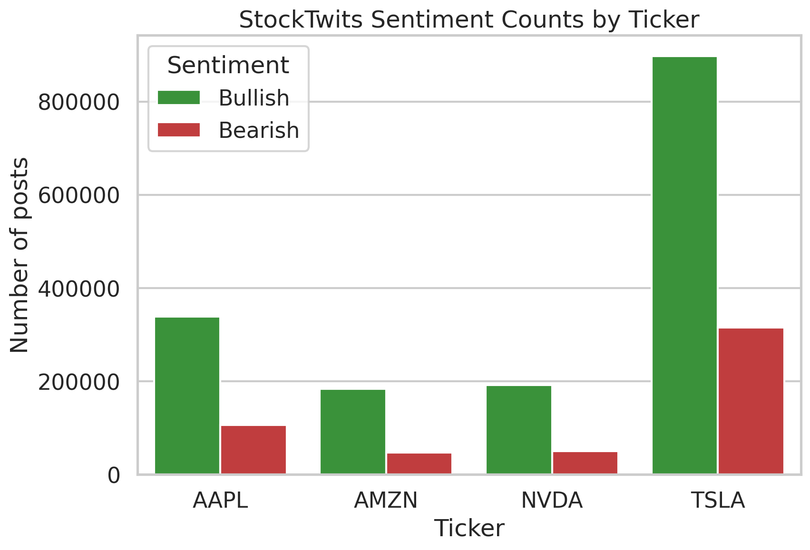
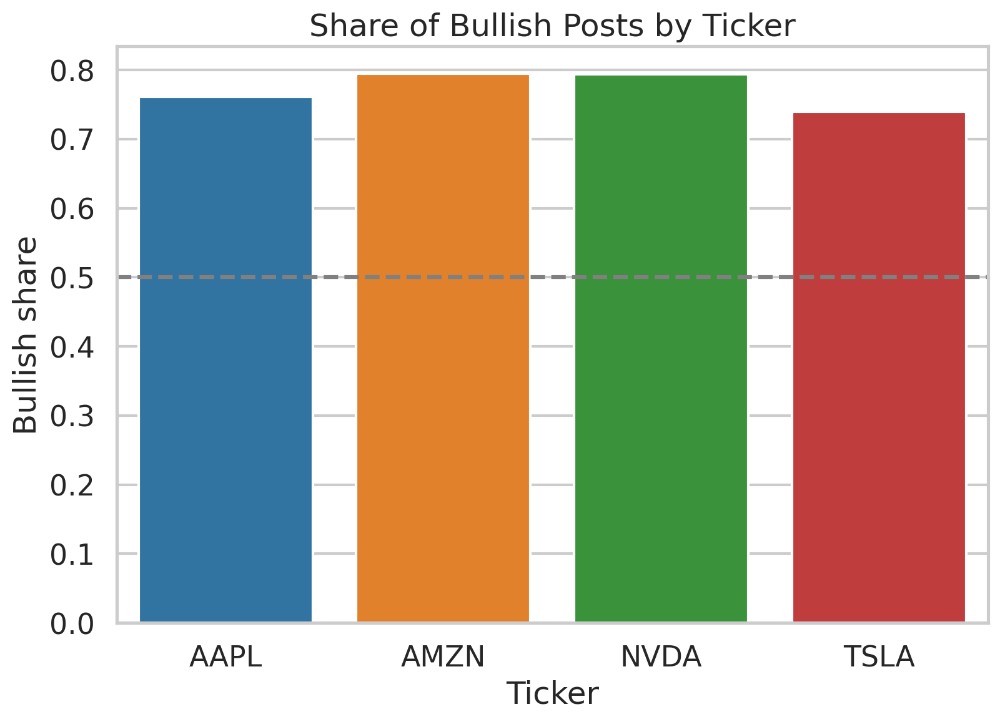
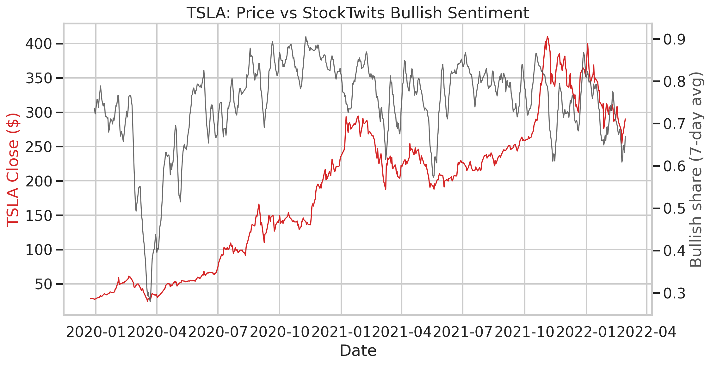
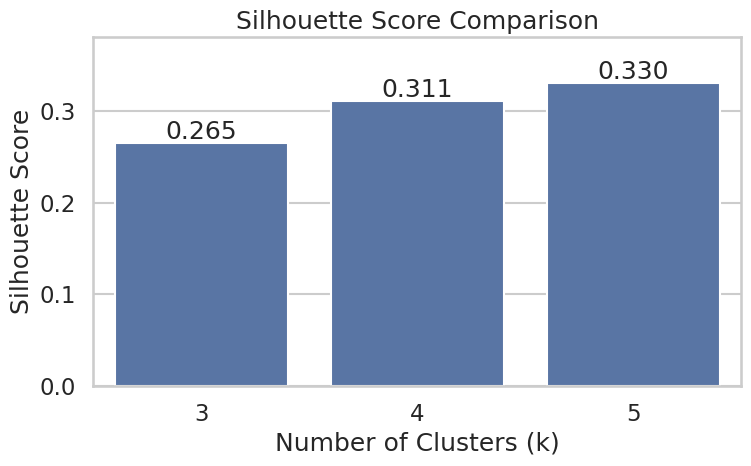
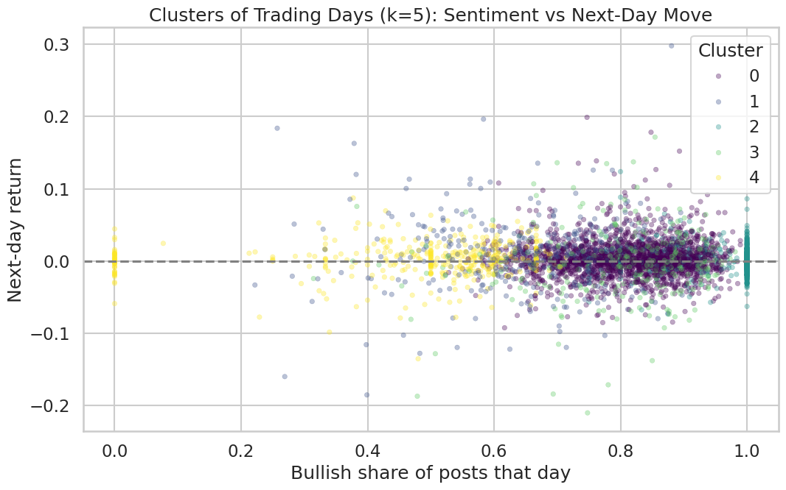

# The Signal and the Noise: Measuring Market Influence

**AI4ALL Ignite, Group 04**
Jasleen Kaur · David Mora · Sonakshi Panda · Shana Ibatuan

> **Research question:** Can we use StockTwits posts and user sentiment to accurately predict future outcomes in the U.S. stock market?

**Live demo:** [stocktwits-market-prediction.streamlit.app](https://stocktwits-market-prediction.streamlit.app/)

---

## Project Overview

Social media shapes how people make financial decisions more than ever. StockTwits is a platform built for investors, where users tag their own posts as **Bullish** or **Bearish** on a given stock. This project asks whether that crowd sentiment carries any real predictive signal, or whether it is mostly noise dressed up as insight.

We focus on four heavily discussed U.S. stocks, **AAPL, AMZN, NVDA and TSLA**, and combine three data sources: daily stock prices, financial news headlines, and millions of StockTwits posts. We clean and align them by ticker and date, build market and sentiment features, then apply a supervised model to predict next-day price direction and an unsupervised model to group trading days by how they behaved.

**How the project evolved.** We started out trying to predict raw price movement from sentiment alone across many global stocks. As we explored the data we narrowed to four tickers with dense posting activity, and switched to a cleaner yes or no target: does the stock close up tomorrow? We later added K-Means when we realised the more interesting story was not a single prediction but the pattern between sentiment extremes and next-day moves.

**A challenge we hit, and how we fixed it.** Our first K-Means used next-day return as a clustering input and then compared the clusters by next-day return, which is circular reasoning. We removed it from the inputs and held it out purely as an outcome measured after the groups were formed. We also found that 56% of the merged rows had no StockTwits posts at all but had been filled with zeros, which drowned out the real signal. We limited the model to days with actual posting activity, leaving 3,936 ticker-days.

---

## Data

| Dataset | Source | Coverage | Role |
|---|---|---|---|
| World Stock Prices (Daily Updating) | Kaggle | 2000 to 2025 | Daily open, high, low, close and volume |
| US Capital Markets News Headlines | Kaggle | 2020 to 2024 | Headlines by ticker (cleaned, kept for future work) |
| StockTwits Post Data | StockTwits | 2020 to 2022 | 4,201,837 raw posts with self-tagged sentiment |

After cleaning and filtering to the four tickers, the StockTwits data gave **1,612,213 Bullish**, **519,413 Bearish** and **2,070,211 untagged** posts, so 2,131,626 tagged posts were usable for sentiment. The raw data is not committed here because of its size. See [`data/README.md`](data/README.md) for how to obtain it.

**Scope note:** this project uses the Bullish and Bearish tags that StockTwits users apply themselves. We did not train a separate text classifier on the raw post wording. That is listed under Next Steps.

---

## Methods and Algorithms

### 1. Next-day direction prediction (supervised)

- **Models:** Logistic Regression and Random Forest, both compared against a majority-class baseline.
- **Type:** Supervised binary classification.
- **Goal:** Predict whether a stock closes up the next trading day.
- **Inputs:** Market features (daily return, volume change, intraday return, daily range, 5-day volatility, price against the 5-day moving average) and sentiment features (bullish, bearish and unknown ratios, log post volume, average sentiment, labelled ratio, day-over-day sentiment change).
- **Output:** `Target_Up`, which is 1 if the next-day return is above zero and 0 otherwise.
- **Why these models:** Logistic Regression gives an interpretable linear baseline; Random Forest can capture non-linear interactions between market and sentiment features. Both are fast to train and easy to explain, which suited a first pass at the question.
- **How we validated:** a time-based split, training on the earlier 80% of dates and testing on the most recent 20%, so the model never sees the future. `Next_Day_Return` is excluded from the features to prevent target leakage. Data is restricted to days with real StockTwits activity (3,936 days: 3,149 train, 787 test).

**Evaluation (test set)**

| Model | Accuracy | Precision | Recall | F1 | ROC-AUC |
|---|---|---|---|---|---|
| Majority baseline | 0.536 | 0.536 | 1.000 | 0.698 | n/a |
| Logistic Regression | 0.506 | 0.530 | 0.699 | 0.603 | 0.502 |
| Random Forest | 0.526 | 0.544 | 0.709 | 0.616 | 0.505 |

**How to read this.** Neither trained model beats the 0.536 majority baseline, and ROC-AUC of roughly 0.50 means the models rank up-days and down-days about as well as chance. The baseline's perfect recall is not a strength; it simply predicts "up" for every row. Feature importance shows every market feature scoring around 0.14 while every sentiment feature scores about 0.02 to 0.03, so sentiment adds very little on top of price action. This is a genuine negative result, not a bug: if a freely available signal reliably predicted tomorrow's direction, it would already be priced in.

### 2. K-Means clustering (unsupervised)

- **Type:** Unsupervised clustering.
- **Goal:** Group individual ticker-days by what StockTwits was saying and how the price moved, then check what happened next.
- **Inputs (per ticker-day):** bullish share of posts, log post volume, same-day return and intraday range, all standardised.
- **Output:** a cluster label per ticker-day.
- **Important:** next-day return is deliberately **not** a clustering input. It is held out and measured only after the clusters are formed, so the comparison is not circular.
- **Why K-Means:** it is simple, interpretable and well suited to finding natural groupings when there are no labels.
- **Choosing k:** we compared k = 3, 4 and 5 using the elbow curve and silhouette scores. Silhouette favoured **k = 5** (0.330, against 0.311 for k = 4 and 0.265 for k = 3), and we confirmed the fifth group was a genuinely different kind of day rather than a split of an existing one. The scores are modest overall, which reflects the fact that trading days overlap heavily rather than forming crisp groups.

**The five groups**

| Group | Days | Bullish share | Post volume | Same-day return | Next-day return |
|---|---|---|---|---|---|
| Normal bullish baseline | 2,052 | 81% | moderate | +0.35% | +0.25% |
| Quiet optimism | 572 | 96% | very low | +0.57% | +0.15% |
| Quiet bearish | 399 | 47% | low | -0.67% | +0.19% |
| **Loud hype spike** | 318 | 80% | highest | **+5.83%** | **-0.27%** |
| **Loud panic selloff** | 365 | 66% | high | **-4.35%** | **+0.81%** |

### 3. Data visualisation

Built with seaborn and matplotlib: indexed price growth, rolling volatility, average trading volume, sentiment counts and bullish share by ticker, a price against sentiment dual-axis chart, the silhouette comparison, and the cluster scatter.

---

## Key Results

- **Sentiment is almost always positive.** StockTwits runs about 76% bullish overall, roughly 74% to 79% per ticker, so the sentiment level on its own barely separates one stock or one day from another.
- **It does not predict next-day direction.** Neither Logistic Regression (0.506) nor Random Forest (0.526) beat the majority baseline (0.536), and ROC-AUC sits near 0.50. Sentiment features rank near the bottom on importance while price and volume features dominate.
- **At the loud extremes it leans the other way.** With next-day return held out of the clustering, the loudest hype days (about +5.8% same-day) average **-0.27%** the next day, while high-volume panic selloffs (about -4.4% same-day) average **+0.81%**. Quiet days show no such effect, so the reversal is concentrated where attention is highest.
- **Answer to the research question:** not reliably. StockTwits sentiment is not a dependable predictor of next-day direction, and if anything it leans contrarian at its extremes. That is a useful result: it argues for caution about trusting social media with investment decisions.

### Supporting charts

**StockTwits sentiment counts by ticker**


**Share of bullish posts by ticker**


**TSLA price against StockTwits bullish sentiment**


**Choosing the number of clusters**


**The five groups of trading days**


Additional charts (price growth, volatility, trading volume) are in the [`figures/`](figures/) folder and in the notebook.

---

## Societal Impact and Bias

**Positive impact.** A clear answer here gives everyday investors, who rarely have the time or tools for deep research, evidence instead of hype. Even the negative finding is useful: showing that loud crowd sentiment does not predict, and slightly reverses, helps people avoid chasing momentum. The project also demonstrates responsible practice: baselines, leakage checks and honest reporting of a result that did not go our way.

**Negative impact.** Tools like this can reinforce herd behaviour and online echo chambers, encourage over-trading, and give a false sense of certainty. Presenting sentiment as "prediction" could mislead inexperienced investors, and the contrarian pattern we found could easily be misread as permission to bet against the crowd.

**How the process of building an AI solution can amplify or reduce bias in our case.**

| Source of bias | Why it is there | How the process can amplify it | How we reduced it |
|---|---|---|---|
| Platform bias | StockTwits leans toward day traders and is about 76% bullish | A model can simply learn to always say bullish | We used ratios and changes in sentiment rather than raw counts, and always compared against a majority baseline |
| Sampling bias | The price dataset only tracks famous, surviving brands, which is survivorship bias | Results get presented as true for all stocks | We scoped every claim to four large U.S. technology stocks |
| Self-reported labels | Tags can be missing, sarcastic or simply wrong | Noisy labels get treated as ground truth | We dropped untagged posts and name this as a known limitation |
| Timing and leakage | Information from the future can slip into the inputs | It quietly inflates accuracy and makes a weak model look strong | We split by time and excluded next-day return from every model and clustering input |

The modelling choices, not just the data, decide whether bias gets amplified or kept in check.

---

## Repository Structure

```
.
├── README.md
├── requirements.txt
├── streamlit_app.py            # interactive dashboard (live demo)
├── .streamlit/
│   └── config.toml
├── notebooks/
│   └── Group_04.ipynb          # full pipeline: cleaning, features, visuals, models, clustering
├── figures/
│   ├── 01_price_trends.png
│   ├── 02_volatility.png
│   ├── 03_volume.png
│   ├── 04_sentiment_counts.png
│   ├── 05_bullish_share.png
│   ├── 06_price_vs_sentiment.png
│   ├── 07_kmeans_clusters.png
│   └── silhouette_comparison.png
└── data/
    └── README.md               # where to get the data, not the data itself
```

---

## How to Run

### The dashboard
Open [stocktwits-market-prediction.streamlit.app](https://stocktwits-market-prediction.streamlit.app/). It sleeps when idle, so give it about 30 seconds to wake up.

To run it locally:
```bash
pip install -r requirements.txt
streamlit run streamlit_app.py
```

### The notebook
1. Request access to the shared Group-04 Google Drive folder, which holds `raw_data/`, and add a shortcut to it in your My Drive.
2. Open `notebooks/Group_04.ipynb` in Google Colab. The loader cell finds the project folder automatically, so it works whatever the folder is called.
3. Use **Runtime > Restart session and run all**. The order is: mount and load, clean stock prices, clean news, clean StockTwits posts, build the daily sentiment summary, merge features, draw the visualisations, train the models, then cluster.
4. Generated files are written to `processed_data/` and `model_ready_data/`.

One quirk worth knowing: `cleaned_stocktwits_posts.csv` is written gzip-compressed despite the `.csv` name, so read it with `pd.read_csv(path, compression="gzip")`.

---

## Next Steps

1. Compare market-only, sentiment-only and combined feature sets to isolate exactly what sentiment contributes. **Target: 15 Aug 2026**
2. Align posts to U.S. market sessions instead of UTC dates, so a post at 8pm counts toward the next trading day. **Target: 31 Aug 2026**
3. Test a longer horizon, such as weekly direction, where sentiment may carry more signal than daily noise. **Target: 15 Sep 2026**
4. Expand beyond four large-cap technology tickers to other sectors and smaller companies. **Target: 30 Sep 2026**
5. Train a text classifier on the raw post wording and compare it against both the self-tagged labels and the news headlines. **Target: 31 Oct 2026**

---

## Citations

1. Divernois, Marc-Antoine, and Damir Filipović. "StockTwits Classified Sentiment and Stock Returns." *Digital Finance*, vol. 6, 2024, pp. 249–281. https://doi.org/10.1007/s42521-023-00102-z
2. Cboe Global Markets. "Cboe Volatility Index." *Cboe*, 2026.
3. S&P Dow Jones Indices. "VIX." *S&P Global*, 2026.
4. Elgiriyewithana, Nidula. "World Stock Prices (Daily Updating)." *Kaggle*, 2026. https://www.kaggle.com/datasets/nelgiriyewithana/world-stock-prices-daily-updating
5. John Snow Labs. "How Is NLP Used In Finance? The Role of Natural Language Processing in Financial and Banking Services." *John Snow Labs*, 7 Mar. 2023.
6. Aslam, Bilal. "Identifying Optimistic Stocks with K-Means Clustering Algorithm." *International Review of Economics and Finance*, vol. 104, 2025, p. 104579. https://doi.org/10.1016/j.iref.2025.104579
7. Yahoo Finance. "Yahoo Finance, Stock Market Live, Quotes, Business and Finance News." *Yahoo Finance*, 2026.

**Data sources:** Kaggle (World Stock Prices, Daily Updating), Kaggle (US Capital Markets News Headlines), StockTwits (post data, 2020 to 2022).

---

*Educational research for AI4ALL Ignite. Not financial advice.*
