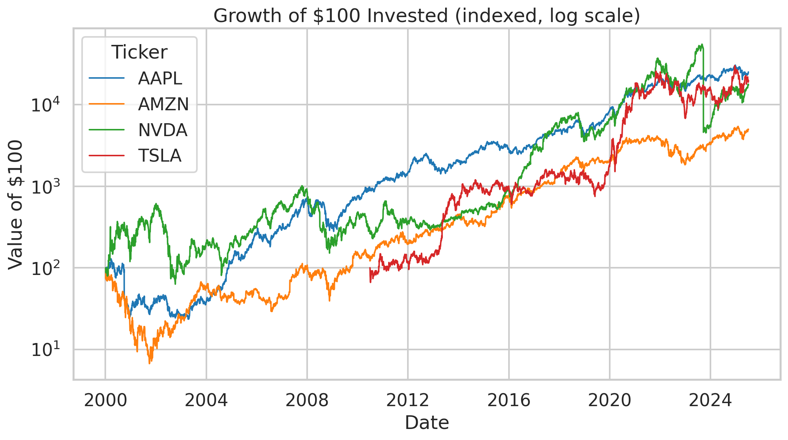

# Using NLP and StockTwits to Predict Market Data

**AI4ALL Ignite — Group 04**
Jasleen Kaur · David Mora · Akzel Davila · Fay Ma · Sonakshi Panda · Shana Ibatuan

> **Research question:** Can we use StockTwits posts and user sentiment to accurately predict future outcomes in the world stock market?

---

## Project Overview

Social media increasingly shapes how people make financial decisions. StockTwits is a platform built specifically for investors, where users tag their posts as **Bullish** or **Bearish** on a given stock. This project investigates whether that crowd sentiment carries any real predictive signal, or whether it is mostly noise and hype.

We focus on four high-attention U.S. stocks — **AAPL, AMZN, NVDA, and TSLA** — and combine three data sources: daily stock prices, financial news headlines, and millions of StockTwits posts. We clean and align these by ticker and date, engineer market and sentiment features, and then apply both a supervised model (to predict next-day price direction) and an unsupervised model (to group trading days by behavior).

**How the project evolved.** We began by aiming to predict raw price *movement* from sentiment alone. As we explored the data, we narrowed the scope to four tickers with dense post activity, shifted the prediction target to a cleaner binary "will the stock close up tomorrow?", and added K-Means clustering when we realized the most interesting story was not a single prediction but the *pattern* between sentiment extremes and next-day reversals.

---

## Data

| Dataset | Source | Coverage | Role |
|---|---|---|---|
| World Stock Prices (Daily Updating) | Kaggle | 2000–2025 | Daily OHLC + volume for the 4 tickers |
| US Capital Markets News Headlines | Kaggle | 2020–2024 | Financial news headlines by ticker |
| StockTwits Post Data | StockTwits | 2020–2022 | 4,201,837 raw posts with Bullish/Bearish tags |

After cleaning and filtering to the four tickers, the StockTwits data yielded **1,612,213 Bullish**, **519,413 Bearish**, and **2,070,211 untagged** posts (2,131,626 tagged posts used for sentiment analysis). Cleaned files are written to a shared Drive folder (see *How to Run*); the raw data is not committed to this repo because of its size.

---

## Methods & Algorithms

### 1. Natural Language Processing — sentiment (supervised)
<!-- AKZEL: fill in model details + evaluation once finalized -->
- **Type:** Supervised classification.
- **Goal:** Estimate the probability that a stock closes **up** the next day.
- **Inputs:** Market features (daily return, volume change, intraday range, 5-day volatility, price vs. 5-day moving average) **and** social features (bullish/bearish ratios, post volume, average sentiment, day-over-day sentiment change).
- **Output:** `Target_Up` — 1 if next-day return > 0, else 0.
- **Evaluation:** _<add accuracy / precision / recall / F1 and a baseline comparison here>_.

### 2. K-Means Clustering (unsupervised)
- **Type:** Unsupervised clustering.
- **Goal:** Group individual trading days by *what StockTwits was saying* and *how the price moved*, to see whether sentiment extremes line up with next-day behavior.
- **Inputs (per ticker-day):** bullish share of posts, log post volume, same-day return, next-day return, intraday range (all standardized).
- **Output:** A cluster label per day. `k` was chosen with the elbow method.
- **Why K-Means:** It's simple, interpretable, and well-suited to finding natural groupings without labels — a good fit for surfacing sentiment/price patterns.

### 3. Data Visualization
Built with **seaborn/matplotlib**: growth-of-$100 price trends, rolling volatility, average trading volume, sentiment counts and bullish share by ticker, a price-vs-sentiment dual-axis chart, and the K-Means cluster scatter.

---

## Key Results

- **Sentiment is structurally optimistic.** StockTwits runs **~76% bullish overall (roughly 74–79% per ticker)**, so the raw bullish *level* barely distinguishes stocks or days.
- **Extremes reverse.** K-Means separated days into interpretable groups. The two extreme clusters behave like a **contrarian** signal: the loudest, most bullish "hype" days are followed on average by price *declines*, while sharp selloff days tend to *bounce back*.
- **Takeaway for the research question:** At its extremes, StockTwits sentiment is closer to a contrarian indicator than a reliable predictor of next-day direction. This supports caution about relying on social media for investment decisions. (Effects are averages and are noisy, but consistent across both extremes.)

### Supporting charts

**Growth of $100 invested (2000–2025)**


**StockTwits sentiment counts by ticker**


**TSLA price vs. StockTwits bullish sentiment**


**K-Means clusters of trading days**


_Additional charts (volatility, trading volume, bullish share) are in the [`figures/`](figures/) folder and the notebook._

---

## Societal Impact & Bias

**Positive impact.** If sentiment carries signal, it could give everyday investors — who lack time or tools for deep research — an additional, free input. Even the *negative* finding is useful: showing that crowd hype reverses helps people avoid chasing momentum.

**Negative impact.** Tools like this can reinforce herd behavior and online echo chambers, encourage over-trading, and give a false sense of certainty. Presenting sentiment as "prediction" could mislead inexperienced investors.

**Sources of bias and how the ML process can amplify or mitigate them.**
- **Sampling bias:** the price dataset tracks only famous, currently-successful U.S. brands (survivorship bias). A model trained on it can *amplify* bias by generalizing to "all stocks." We *mitigate* by explicitly scoping conclusions to these four large-cap U.S. tickers.
- **Platform bias:** StockTwits skews toward day-traders and hype, and is overwhelmingly bullish. A naive model *amplifies* this by learning "always bullish." We *mitigate* by using ratios and sentiment *changes* rather than raw bullish counts, and by comparing against traditional news.
- **Time-zone bias:** global markets trade in different time zones, so U.S.-afternoon posts land after other markets close. We *mitigate* by normalizing timestamps to U.S. market time and aligning strictly by trading date.

---

## Repository Structure

```
.
├── README.md
├── .gitignore
├── notebooks/
│   └── Group_04.ipynb          # full pipeline: cleaning → features → NLP → K-Means → viz
├── figures/                    # exported charts used in the README / presentation
│   ├── price_trends.png
│   ├── sentiment_by_ticker.png
│   ├── price_vs_sentiment.png
│   └── kmeans_clusters.png
├── data/
│   └── README.md               # where to get the data (NOT the data itself)
└── docs/
    └── project_proposal.pdf
```

---

## How to Run

1. Request access to the shared **Group-04** Google Drive folder (contains `raw_data/` and generated `processed_data/`).
2. Open `notebooks/Group_04.ipynb` in Google Colab and add a shortcut to the shared folder in your My Drive.
3. Run the cells top to bottom: mount & load → clean stock prices → clean news → clean StockTwits posts → daily sentiment summary → feature merge → NLP model → K-Means → visualizations.
4. Generated files (`cleaned_*.csv`, `combined_stocktwits_market_data.csv`) are written to `processed_data/`.

> Raw data is not stored in this repo due to size. See `data/README.md`.

---

## Next Steps

- _<Akzel>_ Finalize the sentiment/prediction model and report evaluation metrics against a naive baseline.
- Test whether *sentiment change* (not level) improves next-day prediction, based on the contrarian pattern K-Means surfaced.
- Extend beyond four large-cap U.S. tickers to test how far the conclusions generalize.
- Compare StockTwits sentiment head-to-head with the news-headline data as competing predictors.

---

## Citations

1. Divernois, M.A., Filipović, D. "StockTwits classified sentiment and stock returns." *Digital Finance* 6, 249–281 (2024). https://doi.org/10.1007/s42521-023-00102-z
2. Cboe Global Markets. "Cboe Volatility Index." *Cboe*, 2026.
3. S&P Dow Jones Indices. "VIX." *S&P Global*, 2026.
4. Nelgiriyewithana. "World Stock Prices (Daily Updating)." *Kaggle.* https://www.kaggle.com/datasets/nelgiriyewithana/world-stock-prices-daily-updating/data

**Data sources:** Kaggle (World Stock Prices; US Capital Markets News Headlines), StockTwits (post data).
